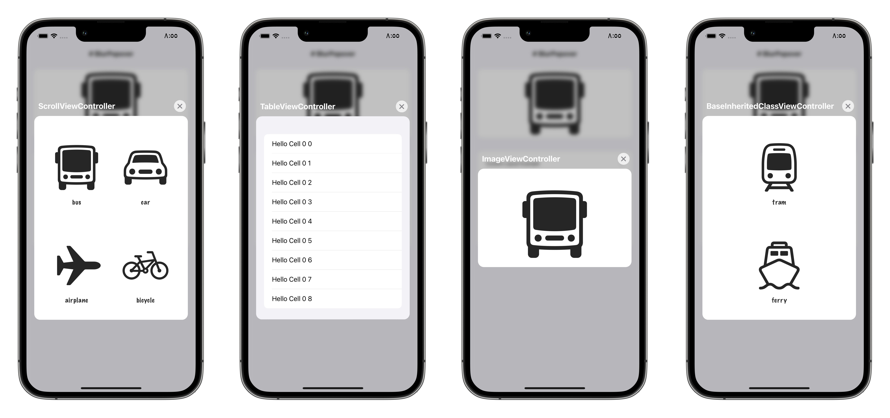

# BlurPopover
Custom presentation controller with a dynamic blur background that increases the blur when swiped up and reduces the blur when swiped down to be dismissed with a title like navigation bars and a dismiss button.



### Installation
`BlurPopover` is currently available either manually by cloning the project and adding the folder `BlurPopover` to your project, or you can use the Swift Package Manager (SPM).

- In Xcode, click File > Swift Packages > Add Package Dependency.
- In the dialog that appears, enter the repository URL: https://github.com/iAmrMohamed/BlurPopover.git
- In Version, select Up to Next Major and take the default option.
- Click Next and select the library `BlurPopover` checkbox, then click Finish and your're all set. 

### Requirements
- Requires iOS 13+

### Usage

It's best to check the examples included in the folder iOS Example.

### Storyboards
Select your view controller and choose from the right side panel the identity inspector and set the class to `BlurPopoverBaseViewController` (if needed set the module to `BlurPopover` too).

### Programmatically

#### Setting the presentation controller manually with `UIViewControllerTransitioningDelegate`
```swift
import BlurPopover

class ViewController: UIViewController {
    override func viewDidLoad() {
        super.viewDidLoad()
    }
    
    @IBAction func presentViewController(_ sender: UIButton) {
        let dvc = CustomViewController()
        dvc.modalPresentationStyle = .custom
        dvc.transitioningDelegate = self
        present(dvc, animated: true)
    }
}

extension ViewController: UIViewControllerTransitioningDelegate {
    func presentationController(forPresented presented: UIViewController, presenting: UIViewController?, source: UIViewController) -> UIPresentationController? {
        BlurPopoverPresentationController(presentedViewController: presented, presenting: presenting)
    }
}
```

#### Inheriting the base class `BlurPopoverBaseViewController`
```swift
import BlurPopover

class ViewController: UIViewController {
    override func viewDidLoad() {
        super.viewDidLoad()
    }
    
    @IBAction func presentViewController(_ sender: UIButton) {
        let dvc = CustomViewController()
        present(dvc, animated: true)
    }
}

class CustomViewController: BlurPopoverBaseViewController {
    override func viewDidLoad() {
        super.viewDidLoad()
    }
}
```

#### Using the shared delegate `BlurPopoverSharedTransitioningDelegate`
```swift
import BlurPopover

class ViewController: UIViewController {
    override func viewDidLoad() {
        super.viewDidLoad()
    }
    
    @IBAction func presentViewController(_ sender: UIButton) {
        let dvc = CustomViewController()
        dvc.modalPresentationStyle = .custom
        
        // source will animate from the view when presenting
        // destination will animate to the view when dismissing
        dvc.transitioningDelegate = BlurPopoverSharedTransitioningDelegate.sharedDelegate(
            presentingSourceView: imageView,
            dismissingDestinationView: imageView
        )
        
        present(dvc, animated: true)
    }
}

class CustomViewController: UIViewController {
    override func viewDidLoad() {
        super.viewDidLoad()
    }
}
```

## Author
[@iAmrMohamed](https://twitter.com/iAmrMohamed)

## License

BlurPopover is available under the MIT license. See the LICENSE file for more info.
